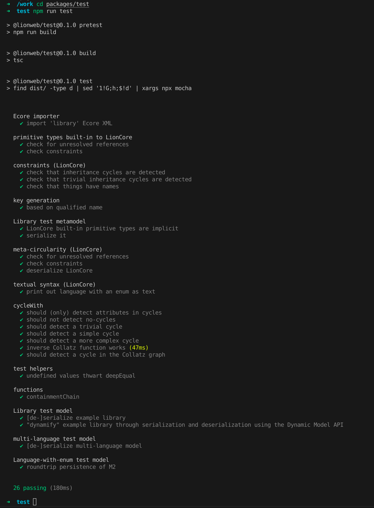

# README

This repository contains TypeScript implementations for parts of the LionWeb standard/specification.
Those are contained in a number of NPM packages in the directory [`packages`](./packages) (in order of importance):

- `core`
  The "core stuff" such as: base types, the LionCore M3 (including the `builtins` language), and (de-)serialization.
- `utilities`
  Utilities on top of the `core` packages that might be broadly useful, but should not go into the `core` package.
- `test`
  A package containing (unit) tests for the packages above.
- `cli`
  A package with an executable to trigger some of the functionality in `utilities` through a commandline interface (CLI), i.e. from the commandline.
- `artifacts`
  A package that generates artifacts (serialization chunks, diagrams, JSON Schemas) from some of the models constructed in the `core` and `test` packages.

The `core`, `utilities`, and `cli` packages are published in the scope of [the `lionweb[package.json](package.json)` organization](https://www.npmjs.com/org/lionweb), meaning that they're all prefixed with `@lionweb/`.
The other packages are for internal use only.

Each of these packages have their own `README.md`.

## Environment dependencies

- [Node.js](https://nodejs.org/): JavaScript runtime, version (at least) v18.18.0 (the LTS version as of 2023-09-29)
  - NPM (bundled with Node.js): version (at least) 9.6.7
- (optional) [PlantUML](https://plantuml.com/).
  An IDE plugin such as the one [for IntelliJ IDEA](https://plugins.jetbrains.com/plugin/7017-plantuml-integration) also does the trick.

Note that development tends to be done with the latest Node.js and NPM versions.
Currently, these are v19.9.0 and 9.8.1.

## Containerized development environment

If you prefer not to install the development dependencies on your machine, you can use our containerized development environment for the LionCore TypeScript project. This environment provides a consistent and isolated development environment that is easy to set up and use. To get started, follow the instructions in our [containerized development environment guide](./documentation/dev-environment.md). However, you can streamline the process by running the following command:

```sh
docker run -it --rm --net host --name working-container -v ${PWD}:/work indamutsa/lionweb-devenv:v1.0.0 /bin/zsh
```

- `docker run`: Initiates a new container.
- `-it`: Enables interactive mode with a pseudo-TTY.
- `--rm`: Removes container after exit.
- `--net host`: Shares the host's network.
- `--name working-container`: Names the container.
- `-v ${PWD}:/work`: Maps host's current directory to `/work` in the container.
- `indamutsa/lionweb-devenv:v1.0.0`: Specifies the Docker image.
- `/bin/zsh`: Starts a Zsh shell inside the container.

## Install Project Dev Dependencies

Run the following command to build each of the packages:

```shell
# Build the project
./build.sh
```

This includes installing any NPM (dev) dependencies.

Run the following command to statically _style_-check the source code in all the packages:

```shell
# Run lint
npm run lint
```

Note that this does not catch TypeScript compilation errors.

## Test the project

Run the following command to run the tests:

```shell
# Run tests
cd packages/test

# Run the tests
npm run test
```

<br />

The output should look like this:
<br />
<br />

