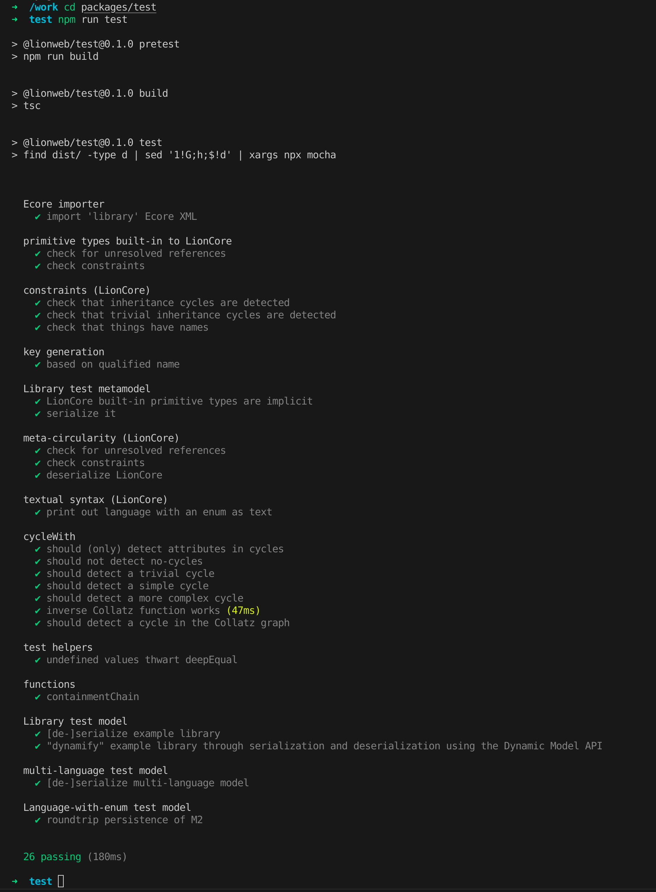

# README

[
](./LICENSE)

[
](https://github.com/LionWeb-io/lionweb-typescript/actions/workflows/test.yaml)

(in alphabetical order of package name:)

[
](https://www.npmjs.com/package/@lionweb/class-core)
[
](https://www.npmjs.com/package/@lionweb/class-core-generator)
[
](https://www.npmjs.com/package/@lionweb/class-core-test-language)
[
](https://www.npmjs.com/package/@lionweb/cli)
[
](https://www.npmjs.com/package/@lionweb/core)
[
](https://www.npmjs.com/package/@lionweb/delta-protocol-client)
[
](https://www.npmjs.com/package/@lionweb/delta-protocol-common)
[
](https://www.npmjs.com/package/@lionweb/delta-protocol-low-level-client-browser)
[
](https://www.npmjs.com/package/@lionweb/delta-protocol-low-level-client-ws)
[
](https://www.npmjs.com/package/@lionweb/delta-protocol-repository-ws)
[
](https://www.npmjs.com/package/@lionweb/io-lionweb-mps-specific)
[
](https://www.npmjs.com/package/@lionweb/json)
[
](https://www.npmjs.com/package/@lionweb/json-diff)
[
](https://www.npmjs.com/package/@lionweb/json-utils)
[
](https://www.npmjs.com/package/@lionweb/node-utils)
[
](https://www.npmjs.com/package/@lionweb/textgen-utils)
[
](https://www.npmjs.com/package/@lionweb/ts-utils)
[
](https://www.npmjs.com/package/@lionweb/utilities)
[
](https://www.npmjs.com/package/@lionweb/validation)

[//]: # (generated by running ./make-badges.js)

This repository contains a TypeScript implementation for (parts of) the [LionWeb specification](https://lionweb-io.github.io/specification/) – specifically: release version **2023.1** of the LionWeb specification.

_Note_ that this repo doesn’t implement the specification completely (yet).
In particular, release versions 2024.1 and 2026.1 of the LionWeb specification are currently not explicitly supported.

The [**delta protocol**](https://github.com/LionWeb-io/specification/blob/main/delta/delta-api.adoc), which is going to be part of the upcoming 2026.1 version, *is* supported in beta state.
(The delta protocol is essentially “orthogonal” to the rest of the specification, so it’s not problematic that 2024.1 and other aspects of 2026.1 aren’t supported either yet.)


## Repo org

The implementation is divided up in a number of NPM packages in the directory [`packages`](./packages) (in alphabetical order of package name) — see their READMEs for more details:

- `build`
  Builds part of the code in `class-core` — specifically the part related to the delta protocol.

  _Note_ that this package – and specifically the `generate-for-class-core.ts` file – depends on `class-core` itself.
  This constitutes a *circular* dependency, but that only exists at compile+build time, so should not be problematic.
  To ensure that a “clean clone” of this repository is not impacted, the `rebuild.sh` script builds `class-core` first, before compiling and running `build`, and then builds `class-core` again.

- `class-core`
  A framework for the implementation of `INode` that’s class-based, and can work with deltas.

- `class-core-generator`
  A code generator to generate classes based on the `class-core` package from an M2.

- `class-core-test`
  Tests that specifically test the `class-core` package.

- `class-core-test-language`
  An implementation of a test language (generated by the `class-core-generator`) that’s used in the various test packages.

- `cli`
  A CLI tool to trigger some of the functionality in `utilities` through a commandline interface (CLI), i.e. from the commandline.

- `core`
  The "core stuff" such as: base types, the LionCore M3 (including the `builtins` language), and (de-)serialization.

- `delta-protocol-client`
  Generic implementation of a client conforming to the delta protocol.
  Needs to be specialized w.r.t. transport layer (WebSocket, etc.) through a *low-level client* passed to the `LionWebClient` class.

- `delta-protocol-common`
  Details of the delta protocol that are (quite likely) common to all implementations of it, regardless of client/repository and transport layer.

- `delta-protocol-low-level-client-browser`
  Implementation of a low-level client that uses the WebSocket API of the browser.

- `delta-protocol-low-level-client-ws`
  Implementation of a low-level client that uses the WebSocket API of Node.js.

- `delta-protocol-repository-ws`
  Implementation of a delta protocol-compliant repository using the WebSocket of Node.js
  *Note*: this implementation is woefully incomplete!

- `delta-protocol-test`
  Tests for the delta protocol implementation.

- `io-lionweb-mps-specific`
  An implementation of the `io.lionweb.mps.specific` language, together with some utilities and convenience.

- `json`
  Encapsulates the JSON serialization format.

- `json-diff`
  Computes differences between LionWeb serialization chunks.

- `json-utils`
  Utilities around the JSON serialization format, also i.c.w. LionCore M3.

- `node-utils`
  General TypeScript utilities that rely on Node.js.

- `test`
  (Unit) tests for the packages above.

- `textgen-utils`
  General utilities for doing text – i.e.: code – generation, typically based on the `littoral-templates` package.

- `ts-utils`
  General TypeScript utilities, e.g. for working with maps and such.

- `utilities`
  Utilities on top of the `core` packages that might be broadly useful, but should not go into the `core` package.

- `validation`
  Validators that validate a JSON serialization.

Each of these packages have their own `README.md`.
All packages **except the internal packages** are published in the scope of [the `lionweb` organization](https://www.npmjs.com/org/lionweb), meaning that they’re all prefixed with `@lionweb/`.
All these packages declare the *same (per release)* NPM semver identification, which isn’t directly related to the release version of the LionWeb specification.


## Environment dependencies

This repo relies on the following tools being installed:

- [Node.js](https://nodejs.org/): JavaScript runtime
  - NPM (bundled with Node.js)
- A shell (compatible with the Bourne shell), to run [`rebuild.sh`](rebuild.sh) and other `.sh` scripts.
  (This might take a little more effort on Windows machines than on Linux or even macOS.)
- (optional) [PlantUML](https://plantuml.com/).
  An IDE plugin such as the one [for IntelliJ IDEA](https://plugins.jetbrains.com/plugin/7017-plantuml-integration) also does the trick.

*Note* that development tends to be done against the latest LTS (or even more recent) versions of Node.js and NPM.


## Development

### Making everything

Run the following command to set up the project:

```shell
npm run clean
npm install
npm run setup
```

(Note: the first one fails on a clean/fresh clone of the repository, but you can ignore that then.)

The chain of preceding commands can also be run as follows:

```shell
npm run initialize
```

### Building, testing, linting

Run the `rebuild.sh` script (re-)**build** (“make”) each of the packages, in dependency order.
This script exits – or at least: should – as soon as the first failure it detected.
It also triggers the `generate` scriptlet of the `build` package, which generates a couple of source files in other packages from various sources across this repo.
It’s necessary to run this script when these sources have changed, or when the code of the `class-core` has changed significantly.
Note that there a cyclic dependency between the `class-core` and `build` packages, which sometimes necessitates running this script twice to arrive at a stable state.
(The `rebuild` scriptlet in the top-level `package.json` runs (only) the `rebuild.sh` script.)

Run the following command to just com-/transpile the TypeScript source code in all packages:

```shell
npm run build
```

(This is typically enough.)

Run the following command to run all the tests:

```shell
npm test
```

The output should look similar to this (but much longer):



The following command statically _style_-checks the source code in all the packages:

```shell
npm run lint
```

*Note* that this does not catch TypeScript compilation errors!
(That’s because linting only does parsing, not full compilation.)


### Version numbers

To keep the version numbers of the various packages under `packages/` aligned throughout this repository, you use the Node.js script [`update-package-versions.js`](./scripts/update-package-versions.js).
You execute this script as follows from the repo's root:

```shell
./scripts/update-package-versions.js
```

This reads the file [`packages/versions.json`](versions.json) and updates the `package.json` files of all *workspace packages* (as listed in the root-level `package.json`) under `packages/` according to it, as well as the main(/root-level) `package.json`.
The format of that `versions.json` file is self-explanatory.
This script runs `npm install` afterward to update the `package-lock.json`.
Inspect the resulting diffs to ensure correctness, and don’t forget to run `npm install` to update the `package-lock.json` in case you made corrections outside of/after running this script.


### Releasing (i.e., publishing) packages

Packages are released to the [npm registry (website)](https://www.npmjs.com/): see the badges at the top of this document.
We’ll use the terms “release/releasing” from now on, instead of “publication/publishing” as npm itself does.
We release all packages *except* for the “internal” packages: `build`, `class-core-test`, `delta-protocol-test`, and `test`.
(These are the `lionweb.internal-packages` mentioned in `versions.json`.)
All packages MUST be released (altogether) *at the same time*.

Releasing all packages involves the following steps:

1. Prepare the release as follows:
   1. Create a `release/<version>` branch off of the `develop` branch.
   2. Update the value of `lionweb.publish-version` in `versions.json`, and run `./scripts/update-package-versions.js`.
   3. Ensure that the `CHANGELOG.md` files of all packages have been updated properly and fully.
   4. Run `npm run initialize` to update `package-lock.json` and catch any (potential) problems.
   5. Commit all changes from ii-iv with an appropriate message.

2. Create a PR merging `release/<version>` into the `main` branch.

3. After approval of the PR, run the `release` script of the package:
    ```shell
    npm run release
    ```
    This requires access as a member of the `lionweb` organization on the npm registry — check whether you can access [the packages overview page](https://www.npmjs.com/settings/lionweb/packages).
    This step also requires a means of authenticating with npm, e.g. using the Google Authenticator app.

4. Merge the PR with a merge commit.

5. Tag the merge commit from step 4 as `<version>`, and push the tag.

6. Rebranch `develop` off from the merge commit from 4 — if necessary by Git shenanigans.
   Then do the following:
   1. Update the value of the `lionweb.publish-version` in `versions.json` to its next expected _beta_ version, e.g. to `0.10.0-beta.0`.
   2. Run `./scripts/update-package-versions.js`.
   3. Run `npm run initialize` to update `package-lock.json` again.
   4. Commit these changes to the `develop` branch.

Note that beta releases are different in a couple of ways:

* Beta releases have versions of the form `<semver>-beta.<beta sequence number>`, e.g.: `0.10.0-beta.0`.
* They are released using the `release-beta` scripts.
    (The `release-beta` scripts *don’t* check whether this naming convention has been observed.)

You can also perform an alpha release in exactly the same way as a beta release, but with all occurrences of "`beta`" replaced with "`alpha`".
Alpha releases should be limited to experimental features.


### Updating external dependencies

Execute the following script from the repo’s root to see whether external dependencies can be updated to a newer version:

```shell
./scripts/update-external-deps.js
```

If any of the external dependencies has a newer(/other) version, then re-run this script with the `--update` flag as argument to update `versions.json` accordingly.
Then, run `./scripts/update-package-versions.js` again to update all `package.json` files.

**Note** that external dependencies have to adhere to a mininum release age of 30 days, configured through the `min-release-age` property in `.npmrc`.
This is to avoid supply chain attacks.
The `update-external-deps.js` script doesn’t check whether a newer version of an external dependency adheres to that.
If it doesn’t, you’re going to see an error message of the following kind when running `npm i[nstall]`:

```
npm error notarget No matching version found for nanoid@5.1.9 with a date before 3/18/2026, 12:50:38 PM.
```


#### Future work

Currently, we’re not using a tool like [`changesets`](https://www.npmjs.com/package/changeset) – including [its CLI tool](https://www.npmjs.com/package/@changesets/cli) – to manage the versioning and release/publication.
That might change in the (near-)future, based on experience with using `changesets` for the [LionWeb repository implementation](https://github.com/LionWeb-io/lionweb-repository/).


## Circular dependencies

Run the NPM task `check-circular-dependencies` to check whether circular dependencies exist in any of the packages.
A circular dependency is a cycle in `import` statements in TypeScript code.
Such circular dependencies don’t necessarily prevent the code from being compilable and runnable, but problems can arise due to web bundlers, and in debugging.
Circular dependencies can usually be avoided by using the “internal module pattern”, which is explained in [this blog](https://medium.com/visual-development/how-to-fix-nasty-circular-dependency-issues-once-and-for-all-in-javascript-typescript-a04c987cf0de).
The TL;DR of that is:

1. Export all *internally*-exposed stuff from a central `index-internal.ts`.
2. Then, import from that file *only*.
3. Export everything you want exposed to the outside world from a `index.ts` which imports from `index-internal.ts`.


### Code style

All the code in this repository is written in TypeScript, with the following code style conventions:

* Indentation is: **4 spaces**.

* **No semicolons** (`;`s).
    This is slightly controversial, but I (=Meinte Boersma) simply hate semicolons as a statement separator that’s virtually always unnecessary.
    The TypeScript compiler simply adds them back in the appropriate places when transpiling to JavaScript.

* Use **"FP-lite"**, meaning using `Array.map` and such functions over more imperative ways to compute results.

We use prettier with parameters defined in `.prettierrc`.
*Note* that currently we don’t automatically run `prettier` over the source code.


## Miscellaneous

### Generate code metrics

Run the following on the command line, in the repo’s root, to get some idea of the size of the codebase:

```shell
$ find packages -name "*.ts*" \! -name "*.d.ts*" -print | grep -v -e "test" | xargs wc | sort > metrics.txt
```


### Check TypeScript for mismatched dependencies

The NPM `lint` task doesn’t check whether `import` statements refer to dependencies that are actually mentioned in the package’s `package.json`.

Run the following on the command line, in the repo’s root, to see where there’s mismatches between `import` statements and the `dependencies` section in a package’s `package.json`.

```shell
$ node --no-warnings packages/build/src/code-reading/check-imports.ts
```

Inspect the console output for mismatches, which are flagged with red or yellow backgrounds.


### Containerized development environment

If you prefer not to install the development dependencies on your machine, you can use our containerized development environment for the LionCore TypeScript project. This environment provides a consistent and isolated development environment that is easy to set up and use. To get started, follow the instructions in our [containerized development environment guide](./documentation/dev-environment.md). However, you can streamline the process by running the following command:

```shell
docker run -it --rm --net host --name working-container -v ${PWD}:/work indamutsa/lionweb-devenv:v1.0.0 /bin/zsh
```

- `docker run`: Initiates a new container.
- `-it`: Enables interactive mode with a pseudo-TTY.
- `--rm`: Removes container after exit.
- `--net host`: Shares the host’s network.
- `--name working-container`: Names the container.
- `-v ${PWD}:/work`: Maps host’s current directory to `/work` in the container.
- `indamutsa/lionweb-devenv:v1.0.0`: Specifies the Docker image.
- `/bin/zsh`: Starts a Zsh shell inside the container.


## Contributing

We’re happy to receive feedback in the form of

* Issues – see the [issue tracker](https://github.com/LionWeb-io/lionweb-typescript/issues).
* Join the [LionWeb Slack](https://join.slack.com/t/lionweb/shared_invite/zt-1zltq8eqv-QJmtsZA8_oscCrO8HOp3FA)!
* Pull Requests.
    We generally prefer to _squash-merge_ PRs, because PRs tend to be a bit of a "wandering journey".
    If all commits in a PR are essentially "atomic" (in a sense that’s at the discretion of the repo’s maintainers), then we can consider merging by _fast-forwarding_.
    We require all PRs to be triggered and scrutinized by a human (developer), and that human is fully responsible for the contents of the PR.

  