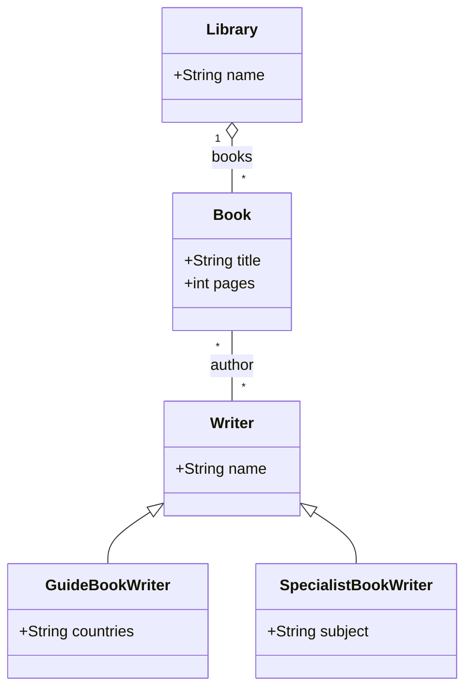

```mermaid
classDiagram

  class Book {
    +String title
    +int pages
  }

  class GuideBookWriter {
    +String countries
  }
  Writer <|-- GuideBookWriter

  class Library {
    +String name
  }

  class SpecialistBookWriter {
    +String subject
  }
  Writer <|-- SpecialistBookWriter

  %% primitive type: "String"

  class Writer {
    +String name
  }

  %% primitive type: "boolean"

  %% primitive type: "int"


  Book "*" -- "*" Writer: author

  Library "1" o-- "*" Book: books


```
