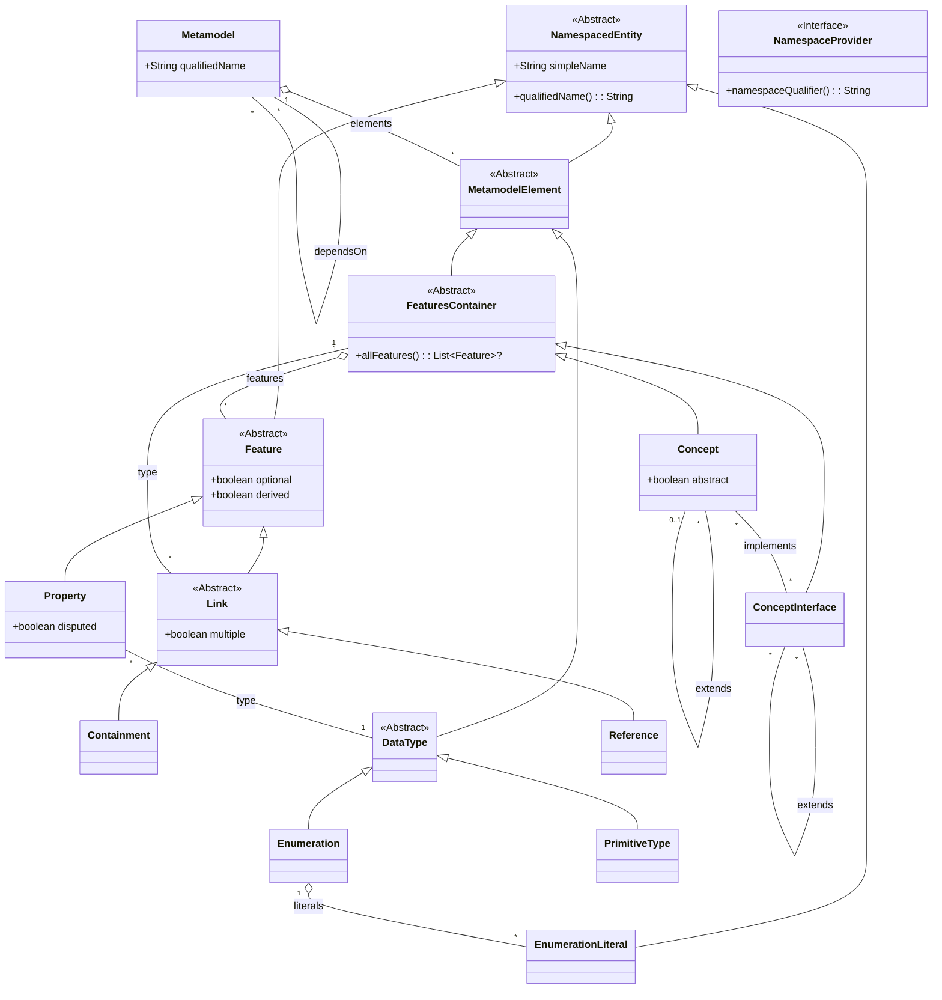

```mermaid
classDiagram

  class Concept {
    +boolean abstract
  }
  FeaturesContainer <|-- Concept

  class ConceptInterface
  FeaturesContainer <|-- ConceptInterface

  class Containment
  Link <|-- Containment

  class DataType
  <<Abstract>> DataType
  MetamodelElement <|-- DataType

  class Enumeration
  DataType <|-- Enumeration

  class EnumerationLiteral
  NamespacedEntity <|-- EnumerationLiteral

  class Feature {
    +boolean optional
    +boolean derived
  }
  <<Abstract>> Feature
  NamespacedEntity <|-- Feature

  class FeaturesContainer {
    +allFeatures() : List~Feature~?
  }
  <<Abstract>> FeaturesContainer
  MetamodelElement <|-- FeaturesContainer

  class Link {
    +boolean multiple
  }
  <<Abstract>> Link
  Feature <|-- Link

  class Metamodel {
    +String qualifiedName
  }

  class MetamodelElement
  <<Abstract>> MetamodelElement
  NamespacedEntity <|-- MetamodelElement

  class NamespaceProvider {
    +namespaceQualifier() : String
  }
  <<Interface>> NamespaceProvider

  class NamespacedEntity {
    +String simpleName
    +qualifiedName() : String
  }
  <<Abstract>> NamespacedEntity

  class PrimitiveType
  DataType <|-- PrimitiveType

  class Property {
    +boolean disputed
  }
  Feature <|-- Property

  class Reference
  Link <|-- Reference


  Concept "*" -- "0..1" Concept: extends
  Concept "*" -- "*" ConceptInterface: implements
  ConceptInterface "*" -- "*" ConceptInterface: extends


  Enumeration "1" o-- "*" EnumerationLiteral: literals


  FeaturesContainer "1" o-- "*" Feature: features
  Link "*" -- "1" FeaturesContainer: type
  Metamodel "1" o-- "*" MetamodelElement: elements
  Metamodel "*" -- "*" Metamodel: dependsOn


  Property "*" -- "1" DataType: type


```
