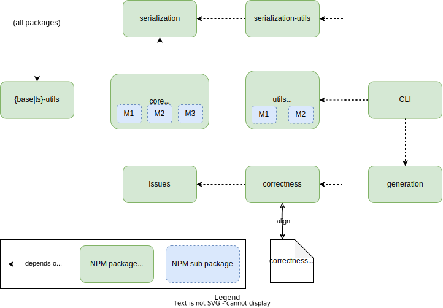

# ROADMAP to version 1

* Update to 2024.1 specification; that includes:
  * [Remove the JSON Standard Primitive type](https://github.com/LionWeb-io/lionweb-typescript/issues/161)
  * [Add support for value types](https://github.com/LionWeb-io/lionweb-typescript/issues/160)
* Re-organize into packages (this is [issue #154](https://github.com/LionWeb-io/lionweb-typescript/issues/154) — see the _“Packages”_ section.
    This might make [issue #86](https://github.com/LionWeb-io/lionweb-typescript/issues/86) obsolete).

## Packages

* `{base|ts}-utils`: LionWeb-agnostic utility/helper functionality, specifically for working with arrays and maps/objects.
    Don't depend on Node.js here — specifically: don't use `node:fs`!
* `serialization`: all serialization types (prefixed with `LionWebJson`), and some utility functionality like comparing meta-pointers.

>  *Jos: I think we should call this `json` instead of 'serialization'?
   These Json objects are still JavaScript.
   The actual serialization functionality is in other packages.*

>  *Jos: And then the next package (serialization-utils) should be called `json-utils`.*

* `serialization-utils`: utilities that deal exclusively with types from the `serialization` package.
    Sub packages:
    * diffing (moved from current `validation`)
    * textualization — i.e., a textual syntax for serialization chunks.
        Allow optional _name provider_ to replace keys/ids with names coming from an M2.
* `core`: the core types for models.
    Sub packages:
    * `M1`: types `LionWebNode`, `LionWebId`, etc., and (de-)serialization of models
    * `M2`: (de-)serialization of languages (M2s), and built-ins including (de-)serialization of primitive values
    * `M3`: types `LionWebLanguage`, `LionWebClassifier`, etc.; LionCore self-definition, symbol table (lookup)
* `utils`: utility/helper functionality around M1s and M2s.
    Sub packages:
    * `M1`: language-aware textualization (delegating to the textualization in `serialization-utils` with a name provider)
    * `M2`: textualization of an M2, infer language from a serialization chunk
> *Jos: alternatively the `lionweb-json-utils` (now called `serialization-utils`) could also be moved here.
       and renamed to `lionweb-json`*
* `issues`: types and utilities (e.g., `JsonPath` moved from the current `validation` package) for issues.

> *Jos: Maybe call this `findings` to align with the unfinished language we were defining.*
  
* `correctness`: validation of serialization chunks, either M2-agnostic or M2-aware — aligned with the correctness document.
> *Maybe posit that this package is developed, **and unit tested** concurrently with the `serialization` and `core` packages?*
* `generation`: generation of TS code, diagrams, etc. based on language definitions
* `cli`: an NPM package that exposes command-line access to functionality in `serialization-utils`, `utils`, and `generation` packages.

## Various thoughts

* Prefix types with `LionWeb`
  * In the `serialization` package: prefix types with `LionWebJson`
  * Don't use `M1/2/3` pre-/infixes as these are “just” for conceptual or technical organization

* Rename `InstantiationFacade` &rarr; `Factory`
  * And `ExtractionFacade` &rarr; `Reflector`?
> *Jos: And make sure there are cookbooks for both them, as I (JW) find them hard to understand and use.
    preferrably simplify them (don't know how yet)*
>> *Meinte: I was thinking that maybe we'd have `Factory` (for instantiating instances), `Writer` (for setting/writing values on instances), and `Reader` (for reading values on instances).*

* Give deserialization a better API:
  * Pair up languages and their factories
  * Make deserialization more configurable:
      * How to deal with unknown classifiers: dynamic instantiation (i.e.: a fall-back factory for the `DynamicNode` type), or ignore
      * Provide a channel to report back (and possibly even “converse”) about unknown classifiers, in such a way that we can distinguish between annotations and concepts
      * Provide a default configuration that is verbose on the console about things missing (like it is now)
      * Provide a way to modify the instantiation, e.g. to install MobX-type things.
  * This is based on the following principles:
    * We can deal with broken models, so a “small” problem in the serialization should not prevent the deserialization as a whole.
      (The GPL types that the model is deserialized into might have a different opinion about it, but that's its problem.)

> *Jos: But there must be a notification os some kind that the model was repaired.*

   * We should uncover _all_ problems during deserialization, not just the first one and then quit.
   * I (=MB) find it useful to do things in an FP-style, so effectively everything should be a `flatMap` of-sorts.
  	In the end, it should be understandable and usable — that's the final criterion.

> *Jos: I (JW) find that too much FP-style often makes things harder to read and understand.
> I find readability more important than being concise, so I agree with the final criterion :-).
       We need to find the right balance here*
      
  * Split readable and writable parts of `Node` interface — i.e., `Reader`, and `Writer`, in addition to `Factory` (see also above).
    * Provide factory getter and `setFeatureValue` that knows about moving children between parents in writable part.

* Issues:
  * [Update top-level `README.md` to also document release process](https://github.com/LionWeb-io/lionweb-typescript/issues/152)

## Way of working

* Principles: documentation and (unit) tests **first**!
  * Provide a _cookbook_
  * In code, provide both what as “what's this used for (and how)” documentation
* Do focused, “burst-mode”, co-located work!
* Keep work in same repo:
  * In a branch `develop-v1`
  * In a sub-directory `v1-packages/`
  * Temporarily use `v1-core` instead of `core` as package name in `package.json` as these need to be unique in a multi-package repo, but directory can be `core/` — same for `cli`
  * At the top-level, prefix NPM script names with `v1-`
  * When ready, copy all `v1-packages/` over to `packages/` — no releasing until then

