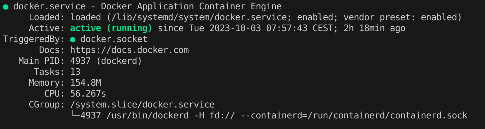
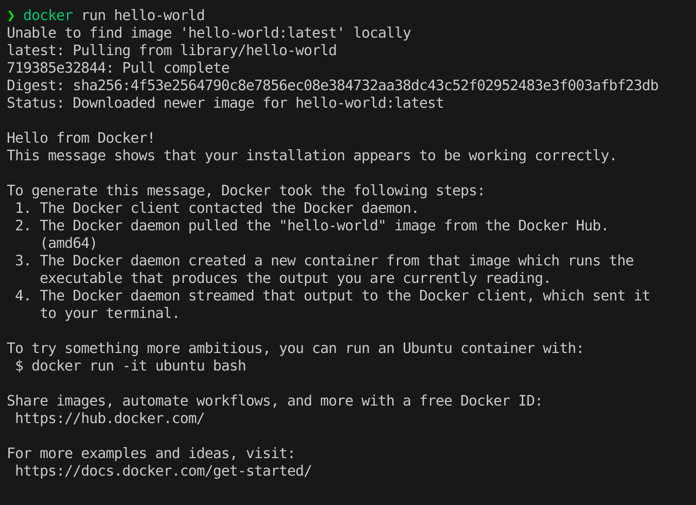

# Containerized Development Environment

In this readme, we will go over how to use the containerized development environment.
The environment ensures that all developers use the same versions of the tools and dependencies. The codebase is portable and can be run on any machine that has docker installed.

The process will later be automated, but for now, we will go over the manual steps.

## Prerequisites

- `docker` must be installed on your machine.
- `git` must be installed on your machine. but you can still download the repository as a zip file.

Nothing else is required. The container will take care of installing all the necessary dependencies.

## Steps

In this section, we will go over the steps to get the development environment up and running.

### 1. Clone the repository

```sh
git clone https://github.com/LionWeb-io/lionweb-typescript.git
```

### 2. Setup a containerized development environment

Make sure the docker daemon is running on your machine.

```sh
# Check that docker is running
sudo systemctl status docker # You may need to run this command as root.
```

The output should look like this:
<br />
<br />


Test that docker is running by running the following command:

```sh
# Test that docker can pull and run images
docker run hello-world
```



Setup the containerized development environment by running the following command:

```sh
# Setup the containerized development environment
docker run -it --net host --name node-working-container \
-v ${PWD}:/work \
-w /work node:20-alpine3.17 /bin/sh -c "apk add --no-cache build-base; npm install -g npm@9.8.1; npm install; exec /bin/sh"
```

The above command will start a container and install the necessary dependencies. It will also mount the current directory to the container's `/work` directory. This means that any changes made to the codebase will be reflected on the host machine and vice versa.

You may sometimes face permission issues when creating files from within the container. To fix this, you can run the following command:

```sh
# Fix permission issues
chown -R 1000:1000 .
```

### 3. Install necessary dependencies and utilities.

Let us create a command folder accessible from across the container

```bash
mkdir -p /cmd
```

## Install common utilities

```bash
# Install common utilities and beautify the terminal
apk update
mkdir -p /cmd # In case you haven't created it already
apk add --no-cache docker curl wget libffi-dev openssl-dev gcc libc-dev make  zip bash openssl git zsh vim nano unzip npm jq
# Install zsh for a cool looking terminal with plugins auto-suggestions and syntax-highlighting
sh -c "$(curl -fsSL https://raw.github.com/robbyrussell/oh-my-zsh/master/tools/install.sh)"

# Set ZSH_CUSTOM if it's not set (this is usually set when zsh starts)
ZSH_CUSTOM=${ZSH_CUSTOM:-$HOME/.oh-my-zsh/custom}

## Clone the zsh-autosuggestions repository into $ZSH_CUSTOM/plugins
git clone https://github.com/zsh-users/zsh-autosuggestions.git $ZSH_CUSTOM/plugins/zsh-autosuggestions
git clone https://github.com/zsh-users/zsh-syntax-highlighting.git $ZSH_CUSTOM/plugins/zsh-syntax-highlighting
sed -i.bak 's/plugins=(git)/plugins=(git zsh-autosuggestions zsh-syntax-highlighting)/' ~/.zshrc
```

Since the container has access to the host machine's docker daemon, we can use the docker command to access the host machine's docker daemon. However these privileges comes with more responsibility. The container has access to the current folder and can delete files and folders. Hence, let us make sure that we confirm before deleting any file or folder.

```bash
cat << 'EOF' > /cmd/confirm_rm_rf.sh
#!/bin/bash

# Check first argument for recursive delete flags
case $1 in
  -r|-rf)
    printf "Do you really wanna delete (yes/no) \n===>: "
    # Reading the input from terminal
    read -r answer
    if [ "$answer" == "yes" ]; then
      sudo rm -rf "$@"
    else
      printf "You didn't confirm!\nExiting, no action taken!\n"
    fi
    ;;
  *)
    # If no "-r" or "-rf", proceed without asking
    rm -i "$@"
    ;;
esac

EOF
chmod +x /cmd/confirm_rm_rf.sh
cat /cmd/confirm_rm_rf.sh


# ---
cat << 'EOF' >> ~/.zshrc
source $ZSH/oh-my-zsh.sh
source $ZSH_CUSTOM/plugins/zsh-autosuggestions
source $ZSH_CUSTOM/plugins/zsh-syntax-highlighting

export PATH="$PATH:/cmd"
alias rm="confirm_rm_rf.sh"

EOF
cat ~/.zshrc

# To apply the changes, the auto-suggestions and syntax-highlighting plugins must be sourced:
source ~/.zshrc
zsh
```

You can test that the above command works by running the following command:

```sh
# Create a file with some text
echo "hello world" > test.txt

# Display the file
cat test.txt

# Delete the file
rm test.txt
```
