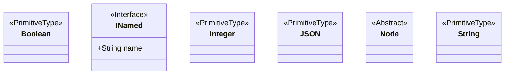

```mermaid
classDiagram

  class Boolean
  <<PrimitiveType>> Boolean

  class INamed {
    +String name
  }
  <<Interface>> INamed

  class Integer
  <<PrimitiveType>> Integer

  class JSON
  <<PrimitiveType>> JSON

  class Node
  <<Abstract>> Node

  class String
  <<PrimitiveType>> String


```
