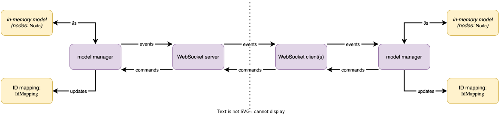

# Delta protocol implementation

## Thoughts

A **model** is a collection of nodes (type `Node` from `@lionweb/core`) that have all been injected with an appropriate delta handler implementation (type `DeltaHandler` from `@lionweb/class-core`).
A **model manager** is an object that holds references to those nodes, exposes that delta handler implementation, can apply ∂s to the model, and maintains an ID mapping (as an instance of the class `IdMapping` from `@lionweb/class-core`).
In addition, *and depending on how it's configured,* it's able to send *events* (that originate from internal ∂s), and to receive *commands* which are subsequently processed.

A *WebSocket server* is able to receive commands from a WebSocket client: it forwards each command to its model manager, after which the model manager can either “upgrade” the command to an event which is sends back to the server for broadcasting across all participants.
A *WebSocket client* is able to initiate a **participation** through a WebSocket server, and to send commands forwarded from its model manager, and to receive events from the WebSocket server and to forward that to its model manager.
(The model manager at the server end has the responsibility to manage participations.)
The WebSocket server and client are essentially symmetric.

The model manager also holds a reference (or reference**s** in the end) to a WebSocket server/client – _“conduit”_ that it uses for communication.

### For now

* Don't bother with setting up participations and doing syntactic validation at first: just get something basic working.
* Add an _optional_ hook/handle for logging: this might be useful for both operations *and* testing.
  (It also gives a bit of a FP-style flavor.)
* The WebSocket server and client implementations might be quite, but don't DRY prematurely!
* Make *all* API calls asynchronous (using `Promise`): in practice not always necessary, but really convenient for testing!

### Plan

1. [&#10003;] Implement a WebSocket-based delta protocol server and client, and make those unit testable.
    * [&#10003;] That requires making things asynchronous!
2. [&#10003;] Implement a client and a server that can start as separate processes, given a WebSocket URL of a LionWeb delta protocol server and the serialization chunk of an initial model (according to a fixed set of `class-core`-compliant languages) to load.
    * [&#10003;] Package this as CLI scripts of an NPM package, e.g. with version `0.0.1-alpha.<n>`.
3. Implement a `ModelManager` that can receive either a WebSocket-based delta protocol server (x)or client.
    The model manager must ensure injecting suitable `DeltaHandler`s.
    **But**: do this only after having fully implemented a *client*.

#### TODOs

* The client exits gracefully when it doesn't detect a server.
* Can `LionWebClient` return a `Promise<[Query]QueryResponse>` so the client's user can just `await` it?

