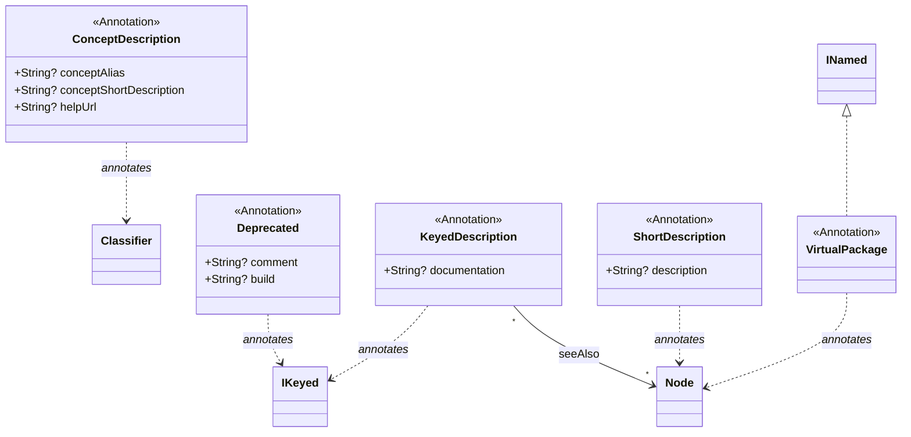

```mermaid
classDiagram

  class ConceptDescription {
    +String? conceptAlias
    +String? conceptShortDescription
    +String? helpUrl
  }
  <<Annotation>> ConceptDescription
  ConceptDescription ..> Classifier : <i>annotates</i>

  class Deprecated {
    +String? comment
    +String? build
  }
  <<Annotation>> Deprecated
  Deprecated ..> IKeyed : <i>annotates</i>

  class KeyedDescription {
    +String? documentation
  }
  <<Annotation>> KeyedDescription
  KeyedDescription ..> IKeyed : <i>annotates</i>

  class ShortDescription {
    +String? description
  }
  <<Annotation>> ShortDescription
  ShortDescription ..> Node : <i>annotates</i>

  class VirtualPackage
  <<Annotation>> VirtualPackage
  VirtualPackage ..> Node : <i>annotates</i>
  INamed <|.. VirtualPackage


  KeyedDescription "*" --> "*" Node: seeAlso


```
