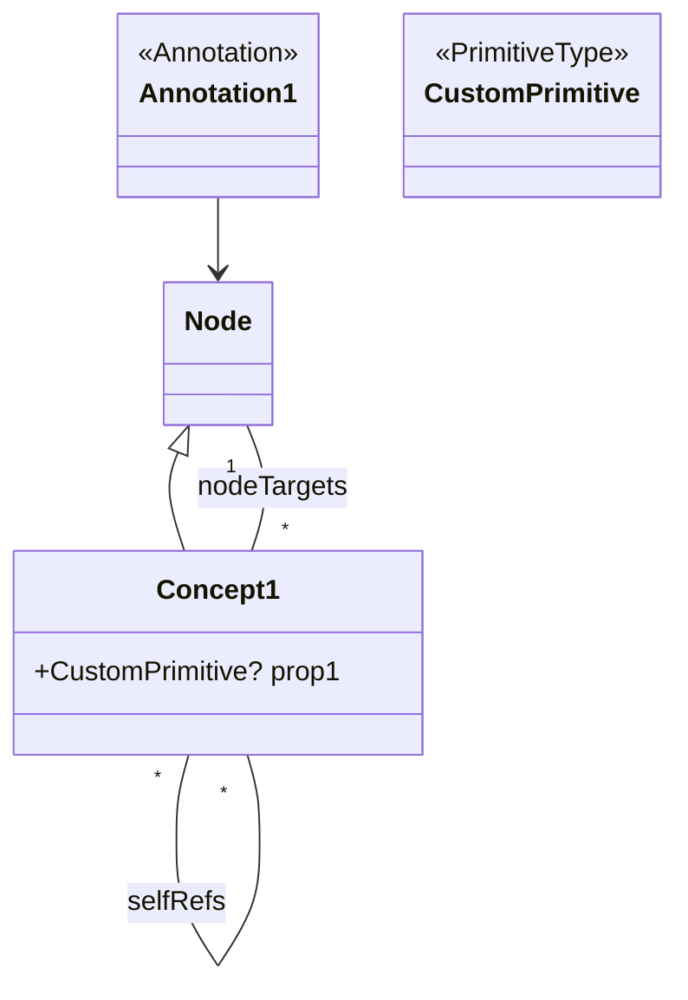

```mermaid
classDiagram

  class Annotation1
  <<Annotation>> Annotation1
  Annotation1 --> Node

  class Concept1 {
    +CustomPrimitive? prop1
  }
  Node <|-- Concept1

  class CustomPrimitive
  <<PrimitiveType>> CustomPrimitive


  Concept1 "*" -- "*" Concept1: selfRefs
  Concept1 "*" -- "1" Node: nodeTargets


```
