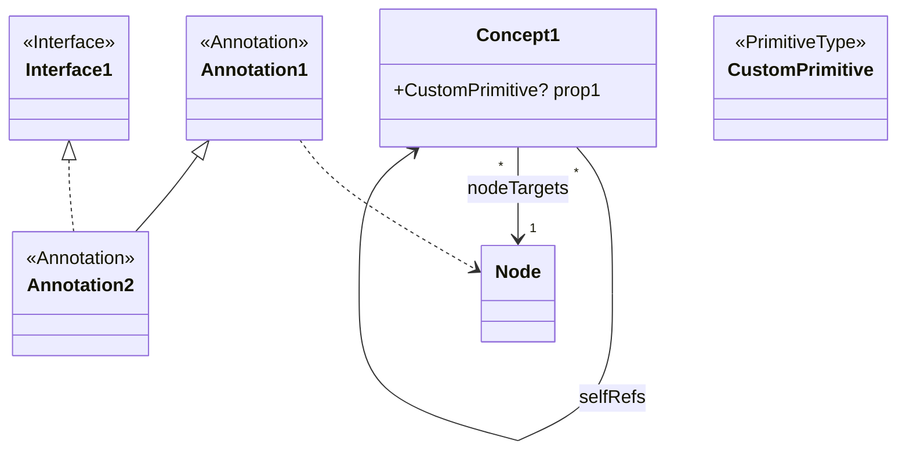

```mermaid
classDiagram

  class Annotation1
  <<Annotation>> Annotation1
  Annotation1 ..> Node

  class Annotation2
  <<Annotation>> Annotation2
  Annotation1 <|-- Annotation2
  Interface1 <|.. Annotation2

  class Concept1 {
    +CustomPrimitive? prop1
  }

  class CustomPrimitive
  <<PrimitiveType>> CustomPrimitive

  class Interface1
  <<Interface>> Interface1


  Concept1 "*" --> "*" Concept1: selfRefs
  Concept1 "*" --> "1" Node: nodeTargets


```
