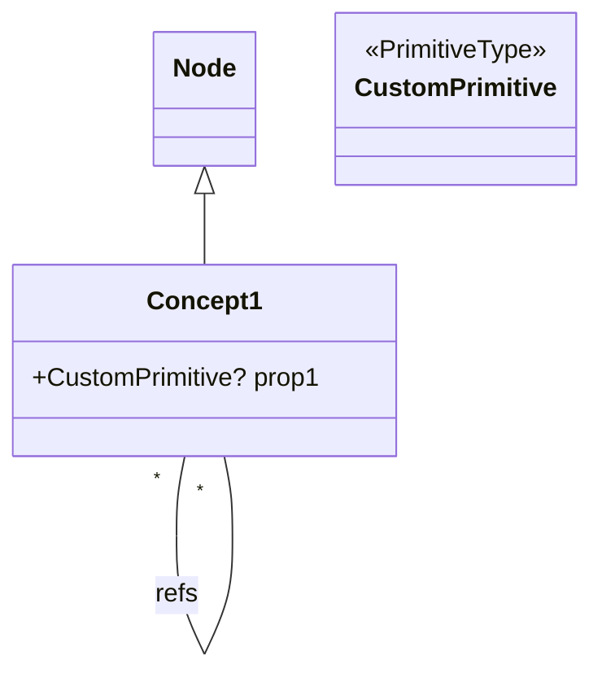

```mermaid
classDiagram

  class Concept1 {
    +CustomPrimitive? prop1
  }
  Node <|-- Concept1

  class CustomPrimitive
  <<PrimitiveType>> CustomPrimitive


  Concept1 "*" -- "*" Concept1: refs


```
