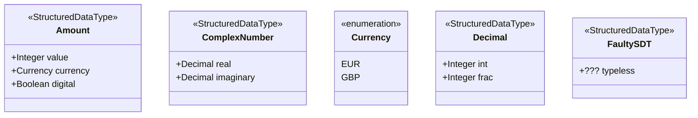

```mermaid
classDiagram

  class Amount {
    <<StructuredDataType>>
    +Integer value
    +Currency currency
    +Boolean digital
  }

  class ComplexNumber {
    <<StructuredDataType>>
    +Decimal real
    +Decimal imaginary
  }

  class Currency {
    <<enumeration>>
    EUR
    GBP
  }

  class Decimal {
    <<StructuredDataType>>
    +Integer int
    +Integer frac
  }

  class FaultySDT {
    <<StructuredDataType>>
    +??? typeless
  }


```
